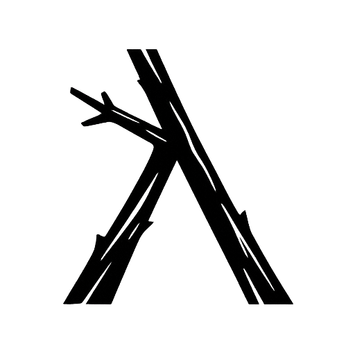

<div align="center">
  
</div>

# Kvist

A practical Lisp for systems programming.

Kvist is a general-purpose Lisp-shaped language for writing fast programs and
small binaries. It is native and statically typed by default, with a
first-class immutable Lisp data world that can be entered explicitly. It gives
you expression-oriented syntax, macros, explicit ownership, and direct memory
management.

Native structs and homogeneous collections remain concrete and predictable.
Quoted `Data` values provide the complementary Lisp model for queries,
configuration, messages, and other heterogeneous data, with zero-allocation
static literals and deterministically managed runtime values.

Kvist transpiles to readable Odin and uses Odin for checking, building, and
running programs. Its syntax and naming are strongly inspired by Clojure, and
its immutable `Data` world follows the Clojure data model. The execution model
stays close to Odin: no VM, no lazy sequence runtime, and no garbage
collection.

Kvist and Odin files can live in the same package. Kvist code can use Odin
packages directly, including Odin's extensive core library and maintained
vendor packages. This provides files, networking, text encodings, cryptography,
math, concurrency, graphics, audio, and more without a Kvist wrapper.

## Quickstart

Install the [Odin compiler](https://odin-lang.org/docs/install/), clone this
repository, and build the Kvist CLI from the repo root:

```sh
git clone https://github.com/kvist-lang/kvist.git
cd kvist
odin build src/cli/kvist
```

Add a main function to a `hello.kvist` file:

```clojure
(defn main []
  (println "hello from kvist"))
```

And run it:

```sh
$ ./kvist run hello.kvist
hello from kvist
```

To install the compiler and shipped packages under a separate root:

```sh
./scripts/install.sh ~/.local/lib/kvist
export PATH="$HOME/.local/lib/kvist/bin:$PATH"
```

## Platform support

Kvist is tested on macOS and Linux. The core CLI and representative programs
are also tested on Windows, but the complete test suite and shell-based tooling
are not yet covered there.

Building Kvist requires an Odin toolchain supported by the host platform.
The scripts in `scripts/` require a POSIX-compatible shell.

## Core Model

- Kvist compiles to readable Odin and uses Odin to check, build, and run.
- Ordinary values are native and statically typed.
- Allocation, mutation, and cleanup remain explicit.
- Lisp forms provide uniform syntax and source macros.
- Immutable `Data` values are available when a heterogeneous data model is
  useful.
- Kvist adds no garbage collector or lazy sequence runtime.

## Example

```clojure
(package main)
(import fmt "core:fmt")

(defstruct User {
  name: string
  score: int
})

(defn main []
  (let [user (User {name: "Ada" score: 42})]
    (fmt.println user.name user.score)))
```

## Tooling

```sh
./kvist check examples/language/hello.kvist
./kvist run examples/language/hello.kvist
./kvist test examples/coverage/packages/test-package-tests.kvist
./kvist eval examples/collections/higher-order.kvist '(threaded-total)'
./kvist expand examples/collections/higher-order.kvist '(threaded-total)'
```

Run `./scripts/smoke.sh` for a quick local check.

## Documentation

- [Language reference](docs/language.md)
- [Data](docs/data.md)
- [Sequences](docs/sequences.md)
- [Transforms](docs/transforms.md)
- [Macros](docs/macros.md)
- [Packages](docs/packages.md)
- [Odin interoperability](docs/odin.md)
- [Parallel helpers](docs/parallel.md)
- [Testing](docs/testing.md)
- [Tooling](docs/tooling.md)
- [Examples](examples/README.md)

## License

Kvist is licensed under the MIT License. See [LICENSE](LICENSE).

Programs written in Kvist, and Odin code generated from user-authored Kvist
source, are not required to use the MIT License merely because they were
compiled with Kvist. Code copied from Kvist packages or runtime support remains
under its applicable license.
